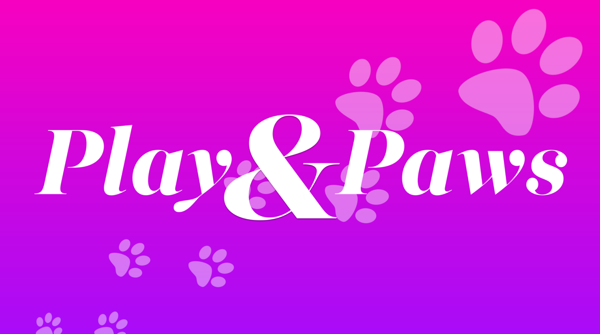

## About

**PlayAndPaws** is an on-demand video player for tvOS made especially for precious cat videos.

Are you enjoying PlayAndPaws? You can say thank you with [a tweet](https://twitter.com/intent/tweet?text=Hey%20@gregchristian%20thank%20you%20for%20your%20tvOS%20on-demand%20cat%20player.%20#meow%eE)

## Requirements

- Runs on iOS 7.0 and later (I think)
- Runs on OS X 10.9 and later

## Warning

PlayAndPaws links out to a cute kitty cat video file ripped from the internet. You must obtain rights or record your own adorabale cat video before submitting and/or making a single dime. Like ever.

## Credits

*PlayAndPaws* runs almost completely on the [tvOS.NativePlayer](https://github.com/martinnormark/tvOS.NativePlayer) project by [Martin H. Normak](https://github.com/martinnormark)

## Contact

Greg Christian

- http://twitter.com/gregchristian
- http://dribbble.com/gregchristian

## License

PlayAndPaws is available under the Creative Commons License. See the [LICENSE](LICENSE) file for more information.
